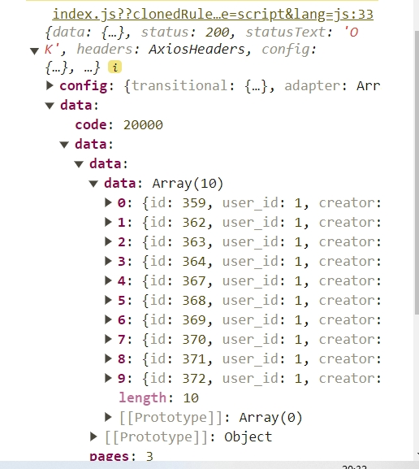
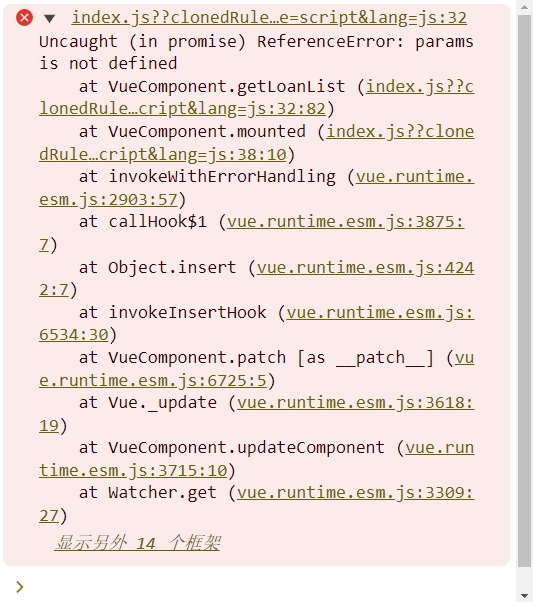

# 项目简介与搭建过程
## 项目简介
### 需求背景
信贷管理系统是一种用于银行、金融机构或其他借贷组织用于管理信贷流程的软件系统。它可以帮助机构管理贷款申请、贷款审批、合同管理等相关流程，提高信贷业务的效率和准确性。

### 需求描述
本需求文档旨在定义信贷管理系统的功能和特性，以满足机构对于信贷业务管理的需求。
信贷管理系统项目基于vue2实现，鉴于vue2的语法已经停止维护，后期会考虑使用vue3重写本项目  <br/><br/>
## 搭建过程
### 新建项目命令
    vue create credit-management-system

<br/>

### 项目配置语言选择


<br/>

**项目启动**

    npm run serve

<br/>

# 登录页面初始化及其vue-router路由编写

## 配置路由

1. 先把app.vue的默认代码删除，留下一个router-view路由出口
    App.vue

```
<template>
  <div id="app">
    <router-view/>
  </div>
</template>

```

2.  打开router文件夹下的index.js，删除掉默认的路由配置

```
Vue.use(VueRouter)

const routes = [

]

const router = new VueRouter({
  routes
})

export default router

```

3.  在main.js里引入公共样式文件，导入和使用elementui组件<br/>
    引入elementui组件

<!---->

    cnpm i element-ui -S

导入使用

    import App from './App.vue'
    import ElementUI from 'element-ui'
    import 'element-ui/lib/theme-chalk/index.css'

    Vue.use(ElementUI)

4.  先在router文件夹下index.js添加一个登录页面的路由和重定向
    组件是使用的懒加载，可以减少页面加载时间

<!---->

    const routes = [
        {
        path:'/',
        redirect:'/login'
      },
      {
        path: '/login',
        name: 'Login',
        component: () => import('../views/Login.vue')
      },
    ]

LoginView\.vue写css之后报错不能解析sass-loader
在命令行执行如下命令

    npm install sass-loader -D

<!---->

    cnpm install node-sass -D

<br/>

引入公共样式normalize.css文件之后出现错误
错误信息：


解决方案：ctrl+shift+p，在setting.json中添加如下
    "javascript.validate.enable": false

## 编写登录页面

## 第一步

```html
<div class="login-box">
    <div class="login-input-box center">
      <h1>信贷管理系统</h1>
    
    </div>
  </div>
```

## 第二步

先定义表单内容放到--上面的h1标签下面

```html
<el-form :model="ruleForm" :rules="rules" status-icon ref="ruleForm" class="demo-ruleForm">
    
        <el-form-item prop="username">
          <el-input prefix-icon="el-icon-user-solid" v-model="ruleForm.username"></el-input>
        </el-form-item>
    
        <el-form-item prop="pass">
          <el-input prefix-icon="el-icon-s-order" type="password" v-model="ruleForm.pass" autocomplete="off"></el-input>
        </el-form-item>

        <el-button type="primary" @click="submitForm">提交</el-button>
      </el-form>
```

## 第三步

1.data中定义一个ruleForm，接收用户名和密码

2.再定义一个rules，限制输入格式

3.在methods中添加一个submitForm表单提交方法和密码限制的validatePass方法

data中：

```js
ruleForm: {
            username: "",
            pass: ""
          }
```

```js
rules: {
        pass: [
          {
            validator: this.validatePass,
            trigger: "blur"
          }
        ],
        username: [{ required: true, trigger: "blur", message: "请输入用户名" }]
      }
```

methods中：

```js
validatePass(rule, value, callback) {
      if (value === "") {
        callback(new Error("请输入密码"));
      } else if (value.length < 6) {
        callback(new Error("密码不能小于6位数"));
      } else {
        callback();
      }
    },
 submitForm(){
 this.$refs.ruleForm.validate(valid => {
        if (valid) {
          // 如果验证通过，
         //调用login方法，传入登录信息，下面会定义
         this.login(this.ruleForm)
        } else {
         
          return false;
        }
      });
  }
```

4.创建login登录方法

```js
async login(form){
    //成功后跳转到首页
     this.$router.replace("/home");
}
```

5.样式的引入

在main.js中引入样式

```js
 import '@/assets/normalize.css';
```

6.在登录界面中引入下面样式

！！！注意语言是scss

```css
<style lang="scss" scoped>
.login-input-box {
  width: 650px;
  height: 320px;
  background: #fff;
  text-align: center;
  padding: 40px 40px 12px 12px;
}

.login-box {
  height: 100%;
  background: url(../assets/bg2.jpg);
  background-size: cover;
}

.el-button {
  width: 600px;
}

.el-input {
  width: 600px;
  margin-bottom: 16px;
}

::v-deep .el-input__inner {
  background: #e5e5e5;
}
</style>
```

# 编写首页

## 添加路由规则

打开router文件夹下的index.js

其中的Layout为布局页面

    //为routes添加
    {
        path: '/',
        redirect:'/home',
            //下面这两个页面按照层级自行创建
        component:()=>  import('@/layout/layout.vue'),
        children:[
          {
          meta:{
           title:'首页'
            },
            path:'/home',
            component:()=> import('@/views/home.vue')
          }
        ]
      }

## layout布局和编写首页及其vue-router路由跳转

layout布局包括侧边栏，导航栏和内容部分

     <div>
        <el-container>
         <el-aside width="240px">
            <el-menu   class="el-menu-vertical-demo" background-color="#545c64"
                text-color="#fff" active-text-color="#ffd04b">
                <!--//没有二级导航的 -->
                 <el-menu-item index="1">
                    <span slot="title"> 首页</span>
                 </el-menu-item>
            
        	 <!--	//有二级导航的 -->
                <el-submenu index="2">
                        <template slot="title">
                        <span>贷款管理</span>
                        </template>
                      <el-menu-item index="2-1">
                         贷款申请
                      </el-menu-item>
                </el-submenu>   
            </el-menu>
        </el-aside>
            <el-container>
                <el-header>
                   <!--//左侧面包屑-->
                   <div class="left">
                       首页
                    </div>
             		<!--//右侧用户名-->
                    <div class="right">
                       <!--// //下拉菜单-->
                       <el-dropdown >
                       
                        <span class="el-dropdown-link"> admin </span>
                       
                        <el-dropdown-menu slot="dropdown">
                             <el-dropdown-item >退出登录</el-dropdown-item>
                        </el-dropdown-menu>
                       
                      </el-dropdown>
                    </div>
                </el-header>
                <el-main>
                    <!-- //放置一个路由出口 -->
                    <router-view />
                </el-main>
            </el-container>
        </el-container>
      </div>

侧边栏包含二级菜单，导航栏最右侧有一个退出登录选择，内容包括了数字滚动和echarts图表

## 数字滚动组件vue-count-to

官网：<https://www.npmjs.com/package/vue-count-to>
安装插件的命令如下

    npm i -S vue-count-to@1.0.13

引入后插入页面使用,在使用命令安装过程中出现如下报错信息


解决方案：<br/>
根据提示检查网络情况，更换手机热点（我开发过程中更换热点仍然报错，应该不是网络原因了）
修改npm的网络设置  npm config list


图中设置用到的命令如下

    npm config set proxy null
    npm config set https-proxy null
    npm config set registry https://registry.npmjs.org/

最初查阅文档之类的设置了很多次，最后有点懵懵哒，npm init了<br/>
稍过一会，再次下载就ok了（也许是设置原因或者最初网络不佳，不是非常确定）<br/>
最后一次成功使用的命令是

    cnpm i -S vue-count-to@1.0.13 

（ npm是node官方的包管理器。 cnpm是个中国版的npm，是淘宝定制的 cnpm (gzip 压缩支持) 命令行工具代替默认的 npm）<br/>


首先设置3个栅格布局，其中属性作用，查看element-ui官网的layout布局

     <div class="home">
        <el-row :gutter="10">
                <el-col :xl="6" :lg="6" :md="12" :sm="24" :xs="24" >
                <div>1</div>
                </el-col>
                <el-col :xl="6" :lg="6" :md="12" :sm="24" :xs="24" >
                <div>2</div>
                </el-col>
                <el-col :xl="6" :lg="6" :md="12" :sm="24" :xs="24" >
                <div>3</div>
            </el-col>
        </el-row>
    </div>

把栅格布局的内容使用数组遍历来显示

    <el-row :gutter="10">
            <el-col :xl="6" :lg="6" :md="12" :sm="24" :xs="24" v-for="(item, index) in list"          :key="index">
              
              <div class="dashboard-item" :style="{ background: item.color }">
                <p>{{ item.title }}</p>
                
              </div>
            </el-col>
    </el-row>

data中定义一个数组

     data(){
            return {
                list: [
                    { val: 13594, title: '最高可借金额', color: '#67ca3a', },
                    { val: 9833, title: '回报率', color: '#ff6600' },
                    { val: 8888, title: '业绩领跑', color: '#f56c6c' },
                    { val: 6666, title: '安稳底薪战队', color: '#409eff' }
                 ]
            }
        }

## echarts图表

### 介绍echart

官网<https://echarts.apache.org/zh/index.html>

### 下载echarts并使用

1.  下载

<!---->

    cnpm i -S echarts@4.9.0

2.  HomeViews页面引入

<!---->

    import echarts from 'echarts';

### 编写第一个图表

1.  定义图表位置

<!---->

    <template>
        <div class="home">
         <el-row :gutter="10">
              <el-col :xl="6" :lg="6" :md="12" :sm="24" :xs="24" v-for="(item, index) in             list"  :key="index">
                  
                <div class="dashboard-item" :style="{ background: item.color }">
                  <p>{{ item.title }}</p>
                  <CountTo :startVal="0" :endVal="item.val" :duration="3000" />
                </div>
              </el-col>
            </el-row>
            
    		<!-- 所有图表位置，一共3个 -->
        <div class="echarts-box">
            <!-- 第一个图表位置-->
          <div class="chart1"></div>

        </div>


        </div>
      </template>

2.  配置图表

添加一个initCharts方法

     initCharts() {
         //初始化图表实例，为什么要添加到this上面，因为后面要检测页面大小改变，更新图表大小
          this.chart1 = echarts.init(document.querySelector('.chart1'));
         //图表配置
         let option1 = {
            title: {
       
            },
            tooltip: {
              trigger: 'axis'
            },
            legend: {
              data: ['Email', 'Union Ads', 'Video Ads', 'Direct', 'Search Engine']
            },
            grid: {
              left: '3%',
              right: '4%',
              bottom: '3%',
              containLabel: true
            },
            toolbox: {
              feature: {
                saveAsImage: {}
              }
            },
            xAxis: {
              type: 'category',
              boundaryGap: false,
              data: ['Mon', 'Tue', 'Wed', 'Thu', 'Fri', 'Sat', 'Sun']
            },
            yAxis: {
              type: 'value'
            },
            series: [
              {
                name: 'Email',
                type: 'line',
                stack: 'Total',
                data: [120, 132, 101, 134, 90, 230, 210]
              },
              {
                name: 'Union Ads',
                type: 'line',
                stack: 'Total',
                data: [220, 182, 191, 234, 290, 330, 310]
              },
              {
                name: 'Video Ads',
                type: 'line',
                stack: 'Total',
                data: [150, 232, 201, 154, 190, 330, 410]
              },
              {
                name: 'Direct',
                type: 'line',
                stack: 'Total',
                data: [320, 332, 301, 334, 390, 330, 320]
              },
              {
                name: 'Search Engine',
                type: 'line',
                stack: 'Total',
                data: [820, 932, 901, 934, 1290, 1330, 1320]
              }
            ]
          }
         
         //应用配置生成图表
          this.chart1.setOption(option1)
     }

3.  在mounted生命周期里执行initCharts方法

<!---->

    mounted() {
        this.initCharts()
     }

4.  图表没有显示

需要设置容器大小

```css
 .chart1 {
    width: 100%;
    height: 400px;
  }
```

### 编写第二个图表

1.

<!---->

    	<!-- 放在第一个图表下面     --> 
    <div class="chart2"></div>

2.  在initCharts方法中编写第二个图表数据

```js
     this.chart2 = echarts.init(document.querySelector('.chart2'));
		//下面都是图表的配置，顺序不能错
    
      let posList = [
        'left',
        'right',
        'top',
        'bottom',
        'inside',
        'insideTop',
        'insideLeft',
        'insideRight',
        'insideBottom',
        'insideTopLeft',
        'insideTopRight',
        'insideBottomLeft',
        'insideBottomRight'
      ];
      let app = {};

      app.configParameters = {
        rotate: {
          min: -90,
          max: 90
        },
        align: {
          options: {
            left: 'left',
            center: 'center',
            right: 'right'
          }
        },
        verticalAlign: {
          options: {
            top: 'top',
            middle: 'middle',
            bottom: 'bottom'
          }
        },
        position: {
          options: posList.reduce(function (map, pos) {
            map[pos] = pos;
            return map;
          }, {})
        },
        distance: {
          min: 0,
          max: 100
        }
      };
      app.config = {
        rotate: 90,
        align: 'left',
        verticalAlign: 'middle',
        position: 'insideBottom',
        distance: 15,
        onChange: function () {
          const labelOption = {
            rotate: app.config.rotate,
            align: app.config.align,
            verticalAlign: app.config.verticalAlign,
            position: app.config.position,
            distance: app.config.distance
          };
          this.chart2.setOption({
            series: [
              {
                label: labelOption
              },
              {
                label: labelOption
              },
              {
                label: labelOption
              },
              {
                label: labelOption
              }
            ]
          });
        }
      };
      const labelOption = {
        show: true,
        position: app.config.position,
        distance: app.config.distance,
        align: app.config.align,
        verticalAlign: app.config.verticalAlign,
        rotate: app.config.rotate,
        formatter: '{c}  {name|{a}}',
        fontSize: 16,
        rich: {
          name: {}
        }
      };
      let option2 = {
        tooltip: {
          trigger: 'axis',
          axisPointer: {
            type: 'shadow'
          }
        },
        legend: {
          data: ['Forest', 'Steppe', 'Desert', 'Wetland']
        },
        toolbox: {
          show: true,
          orient: 'vertical',
          left: 'right',
          top: 'center',
          feature: {
            mark: { show: true },
            dataView: { show: true, readOnly: false },
            magicType: { show: true, type: ['line', 'bar', 'stack'] },
            restore: { show: true },
            saveAsImage: { show: true }
          }
        },
        xAxis: [
          {
            type: 'category',
            axisTick: { show: false },
            data: ['2012', '2013', '2014', '2015', '2016']
          }
        ],
        yAxis: [
          {
            type: 'value'
          }
        ],
        series: [
          {
            name: 'Forest',
            type: 'bar',
            barGap: 0,
            label: labelOption,
            emphasis: {
              focus: 'series'
            },
            data: [320, 332, 301, 334, 390]
          },
          {
            name: 'Steppe',
            type: 'bar',
            label: labelOption,
            emphasis: {
              focus: 'series'
            },
            data: [220, 182, 191, 234, 290]
          },
          {
            name: 'Desert',
            type: 'bar',
            label: labelOption,
            emphasis: {
              focus: 'series'
            },
            data: [150, 232, 201, 154, 190]
          },
          {
            name: 'Wetland',
            type: 'bar',
            label: labelOption,
            emphasis: {
              focus: 'series'
            },
            data: [98, 77, 101, 99, 40]
          }
        ]
      };
      
      this.chart2.setOption(option2);
```

3.  设置第二个图表的容器大小

<!---->

    .chart2 {
        height: 400px;
        width: 50%;
      }

### 编写第三个图表

1.

```html
      <!--放到第二个图表下面 -->
<div class="chart3"></div>
```

2.  配置第三个图表信息

```js
      this.chart3 = echarts.init(document.querySelector('.chart3'));
    let option3  = {
        angleAxis: {},
        radiusAxis: {
          type: 'category',
          data: ['Mon', 'Tue', 'Wed', 'Thu'],
          z: 10
        },
        polar: {},
        series: [
          {
            type: 'bar',
            data: [1, 2, 3, 4],
            coordinateSystem: 'polar',
            name: 'A',
            stack: 'a',
            emphasis: {
              focus: 'series'
            }
          },
          {
            type: 'bar',
            data: [2, 4, 6, 8],
            coordinateSystem: 'polar',
            name: 'B',
            stack: 'a',
            emphasis: {
              focus: 'series'
            }
          },
          {
            type: 'bar',
            data: [1, 2, 3, 4],
            coordinateSystem: 'polar',
            name: 'C',
            stack: 'a',
            emphasis: {
              focus: 'series'
            }
          }
        ],
        legend: {
          show: true,
          data: ['A', 'B', 'C']
        }
      }
      this.chart3.setOption(option3); 

```

3.  设置css样式

```css
 .chart3 {
    height: 400px;
    width: 50%;
  }
```

# 贷款申请

## 页面跳转

在layout布局页面写贷款申请的相关内容，首先用router-link设置跳转页面

     <router-link to="/loan-input/index">贷款申请</router-link>

在index.js里面编写路由

      {
        path: '/loan',
        redirect: '/loan-input/index',
        component: () => import('@/layout/layout.vue'),
        children: [
          {
            meta: {
              title: '贷款申请'
            },
            path: '/loan-input/index',
            name: '/loan-input',
            component: () => import('@/views/loan/IndexView.vue')
          }
        ]
      }

编写之后可以跳转到贷款申请页面，但是在贷款申请页面点击首页无法跳转，这个时候可以给首页添加router-link，后续可能有最佳实践（欲知后事如何，请听下回分解）<br/>
下面是修改后的代码

          <el-menu-item index="1">
            <span slot="title"> 
              <router-link to="/home">首页</router-link>
            </span>
          </el-menu-item>

## 信息表内容IndexView\.vue

信息表的内容以卡片的形式呈现，使用elementui中的卡片card,注意将卡片布局写入el-form中
信息表的信息分行显示，采用栅格布局

     <el-form :model="form" ref="form" label-width="80px">
            <el-card class="box-card">
              <div slot="header" class="clearfix">
                <span>个人基本信息</span>
              </div>
            </el-card>
        </el-form>

!()\[4.png]
观察span标签的个人基本信息四个字的dom结构，尝试将文字居左。

    .card-box{
       >div{
            >div{
                text-align: left;
            }
       }
    }

贷款申请的样式会颜色，如果想重置，添加下面的样式

    a:link {
      text-decoration: none;
      color: #fff;

    }

    /* 状态二: 已经访问过的链接 */
    a:visited {
      text-decoration: none;
      color: #fff;
    }

    /* 状态三: 鼠标划过(停留)的链接(默认红色) */
    a:hover {
      text-decoration: none;
      color: #fff;

    }
    /* 状态四: 被点击的链接 */
    a:active {
      text-decoration: none;
      color: #fff;
    }

### 第一个card个人基本信息

个人基本信息具体内容使用栅格布局

```

<el-card class="box-card">
        <div slot="header">
            <span>个人基本信息</span>
        </div>
    	
        <el-row> 
               <el-col
                    :xl='8' :lg='8'
                    :md="12" :sm="24" :xs="24" >
                						<!-- prop的值是下面form后面的属性名也就是name -->
                    <el-form-item label="姓名" prop="name">
                                            <!-- 等所有表单写完统一设置属性接收-->
                        <el-input  type='input' v-model="form.name" ></el-input>
                    </el-form-item>
                </el-col>  
            
            
        </el-row>      
    
    
    </el-card> 
```

下面三个el-col都是放到el-row里面的

    <el-col
            :xl='8' :lg='8'
            :md="12" :sm="24" :xs="24">
        <el-form-item label="出生日期" prop="birthday">
            <!-- 宽度会有点小，后面复制样式后会改变 -->
            <el-date-picker
                            v-model="form.birthday"
                            type="date"
                            placeholder="选择日期">
            </el-date-picker>
        </el-form-item>
    </el-col>  

    <el-col
            :xl='8' :lg='8'
            :md="12" :sm="24" :xs="24">
        <el-form-item label="性别" prop="sex">
            <el-select  v-model="form.sex" >
                <el-option
                           key="man"
                           label="男"
                           value="man">
                </el-option>
                <el-option
                           key="woman"
                           label="女"
                           value="woman">
                </el-option>
            </el-select>
        </el-form-item>
    </el-col>   

    <el-col
            :xl='8' :lg='8'
            :md="12" :sm="24" :xs="24">
        <el-form-item label="身份证" prop="identity_card">
            <el-input  type='input' v-model="form.identity_card" ></el-input>
        </el-form-item>
    </el-col>

添加第二个el-row

在第一个el-row下面添加

```html
 <el-row>
            <el-col
                    :xl='8' :lg='8'
                    :md="12" :sm="24" :xs="24">
                    <el-form-item label="婚姻状态" prop="marriage">
                        <el-select  v-model="form.marriage" >
                       <el-option
                                key="married"
                                label="已婚"
                                value="married">
                        </el-option>
                        <el-option
                                key="unmarried"
                                label="未婚"
                                value="unmarried">
                        </el-option>
                    </el-select>
                    </el-form-item>
                </el-col>   
        </el-row>   
```

添加在第二个el-row里面

```html

  <el-col
          :xl='8' :lg='8'
          :md="12" :sm="24" :xs="24">
      <el-form-item label="教育程度" prop="education">
          <el-select  v-model="form.education" >
              <el-option
                         key="college"
                         label="大学"
                         value="college">
              </el-option>
              <el-option
                         key="highschool"
                         label="高中"
                         value="highschool">
              </el-option>
          </el-select>
      </el-form-item>
</el-col> 
<el-col
        :xl='8' :lg='8'
        :md="12" :sm="24" :xs="24" >
    <el-form-item label="居住地址" prop="address1">
        <el-input  type='input' v-model="form.address1" ></el-input>
    </el-form-item>
</el-col>  
```

添加第三个el-row

```html
  <el-row>
             <el-col
                    :xl='8' :lg='8'
                    :md="12" :sm="24" :xs="24" >
                    <el-form-item label="户籍地址" prop="address2">
                        <el-input  type='input' v-model="form.address2" ></el-input>
                    </el-form-item>
                </el-col>  
                <el-col
                    :xl='8' :lg='8'
                    :md="12" :sm="24" :xs="24" >
                    <el-form-item label="居住电话" prop="phone">
                        <el-input  type='input' v-model="form.phone" ></el-input>
                    </el-form-item>
                </el-col>  
                <el-col
                    :xl='8' :lg='8'
                    :md="12" :sm="24" :xs="24" >
                    <el-form-item label="手机号" prop="mobile_phone">
                        <el-input  type='input' v-model="form.mobile_phone" ></el-input>
                    </el-form-item>
                </el-col>  
        </el-row> 
```

### 第二个card，职业信息

1.添加第二个card

```html
<el-card class="box-card">
        <div slot="header">
            <span>职业信息</span>
        </div>
        <el-row> 
            <el-col
                    :xl='8' :lg='6'
                    :md="12" :sm="24" :xs="24" >
                    <el-form-item label="现职公司" prop="company">
                        <el-input  type='input' v-model="form.company" ></el-input>
                    </el-form-item>
            </el-col>

                <el-col
                    :xl='8' :lg='6'
                    :md="12" :sm="24" :xs="24" >
                    <el-form-item label="所属行业" prop="trade">
                        <el-select  placeholder='请选择Green'  v-model="form.trade" >
                       <el-option
                                key="education"
                                label="教育"
                                value="education">
                        </el-option>
                        <el-option
                                key="finance"
                                label="金融"
                                value="finance">
                        </el-option>
                    </el-select>
                    </el-form-item>
             </el-col> 
             <el-col
                    :xl='8' :lg='6'
                    :md="12" :sm="24" :xs="24" >
                    <el-form-item label="职位" prop="position">
                        <el-input  type='input' v-model="form.position" ></el-input>
                    </el-form-item>
                </el-col>   
             <el-col
                    :xl='8' :lg='6'
                    :md="12" :sm="24" :xs="24" >
                    <el-form-item label="公司地址" prop="address3">
                        <el-input  type='input' v-model="form.address3" ></el-input>
                    </el-form-item>
                </el-col>   
        </el-row>   
        
        <el-row>
            <el-col
                    :xl='8' :lg='8'
                    :md="12" :sm="24" :xs="24" >
                    <el-form-item label="公司类型" prop="company_type">
                        <el-input  type='input' v-model="form.company_type" ></el-input>
                    </el-form-item>
            </el-col>
            <el-col
                    :xl='8' :lg='8'
                    :md="12" :sm="24" :xs="24" >
                    <el-form-item label="公司邮箱" prop="company_email">
                        <el-input  type='input' v-model="form.company_email" ></el-input>
                    </el-form-item>
            </el-col>
            <el-col
                    :xl='8' :lg='8'
                    :md="12" :sm="24" :xs="24">
                    <el-form-item label="公司电话" prop="company_phone">
                        <el-input  type='input' v-model="form.company_phone" ></el-input>
                    </el-form-item>
            </el-col>
        </el-row>
    </el-card>
```

### 第三个card，收支情况

```html
<el-card class="box-card">
        <div slot="header">
            <span>收支情况</span>
        </div>
        <el-row> 
            <el-col
                    :xl='8' :lg='12'
                    :md="12" :sm="24" :xs="24" >
                    <el-form-item label="收支情况" prop="income">
                        <el-input  type='input' v-model="form.income" ></el-input>
                    </el-form-item>
            </el-col>

        </el-row>   
    </el-card>
```

### 第四个card，家庭联系人

```html
<el-card class="box-card">
        <div slot="header">
            <span>家庭联系人</span>
        </div>
        <el-row> 
            <el-col
                    :xl='12' :lg='12'
                    :md="12" :sm="24" :xs="24" >
                    <el-form-item label="关系1" prop="contact">
                        <el-input  type='input' v-model="form.contact" ></el-input>
                    </el-form-item>
            </el-col>
            <el-col
                    :xl='12' :lg='12'
                    :md="12" :sm="24" :xs="24" >
                    <el-form-item label="姓名" prop="contact_name">
                        <el-input  type='input' v-model="form.contact_name" ></el-input>
                    </el-form-item>
            </el-col>
        </el-row>   
        <el-row>
            <el-col
                    :xl='12' :lg='12'
                    :md="12" :sm="24" :xs="24" >
                    <el-form-item label="手机" prop="contact_phone">
                        <el-input  type='input' v-model="form.contact_phone" ></el-input>
                    </el-form-item>
            </el-col>
        </el-row>
    </el-card>

```

### 第五个card,工作证明人

```html
<el-card class="box-card">
        <div slot="header">
            <span>工作证明人</span>
        </div>
        <el-row> 
            <el-col
                    :xl='12' :lg='12'
                    :md="12" :sm="24" :xs="24" >
                    <el-form-item label="关系2" prop="contact2">
                        <el-input  type='input' v-model="form.contact2" ></el-input>
                    </el-form-item>
            </el-col>
            <el-col
                    :xl='12' :lg='12'
                    :md="12" :sm="24" :xs="24" >
                    <el-form-item label="姓名" prop="contact2_name">
                        <el-input  type='input' v-model="form.contact2_name" ></el-input>
                    </el-form-item>
            </el-col>

            <el-col
                    :xl='12' :lg='12'
                    :md="12" :sm="24" :xs="24" >
                    <el-form-item label="手机" prop="contact2_phone">
                        <el-input  type='input' v-model="form.contact2_phone" ></el-input>
                    </el-form-item>
            </el-col>
        </el-row>   
        <el-row> 
            <el-col
                    :xl='12' :lg='12'
                    :md="12" :sm="24" :xs="24" >
                    <el-form-item label="部门" prop="contact2_dep">
                        <el-input  type='input' v-model="form.contact2_dep" ></el-input>
                    </el-form-item>
            </el-col>
            <el-col
                    :xl='12' :lg='12'
                    :md="12" :sm="24" :xs="24" >
                    <el-form-item label="职位" prop="contact2_pos">
                        <el-input  type='input' v-model="form.contact2_pos" ></el-input>
                    </el-form-item>
            </el-col>
        </el-row>  
        <el-row> 
            <el-col
                    :xl='12' :lg='12'
                    :md="12" :sm="24" :xs="24" >
                    <el-form-item label="备注" prop="remark">
                        <el-input  type='textarea' v-model="form.remark" ></el-input>
                    </el-form-item>
            </el-col>
        </el-row>  
    </el-card>
```

### 提交按钮和重置，放到最后一个card下面

```html
<el-button @click="createUser" type="primary">立即创建</el-button>
<el-button @click="reset">重置</el-button>
```

### 引入css样式

```css
<style lang="scss" scoped>
.el-select,.el-input {
    width: 100%;
}
.btns {
    text-align: center;
}

.box-card {
    margin-bottom: 10px;
    >div {
        >div {
            text-align: left;
        }
    }
}
</style>
```

### 定义form的属性，接收数据

```js
form:{
            name:'' ,
            birthday:'',
            sex:'',
            identity_card:'',
            marriage:'',
            education:'',
            address1:'',
            address2:'',
            phone:'',
            mobile_phone:'',
            company:'',
            trade:'',
            position:'',
            address3:'',
            company_type:'',
            company_email:'',
            company_phone:'',
            income:'',
            contact:'',
            contact_name:'',
            contact_phone:'',
            contact2:'',
            contact2_name:'',
            contact2_phone:'',
            contact2_dep:'',
            contact2_pos:'',
            remark:''
        }
```

### 为form添加rules规则校验

1.  为el-form上设置rules

```html
    <el-form ref="form" :model="form" :rules="rules"  label-width="80px">
```

2.  data中定义rules
    required: true必填校验

```js

rules: {
        name: [
            { required: true, message: "请输入姓名", trigger: "blur" },
            {
                min: 2,
                max: 5,
                message: "长度在 2 到 5 个字符",
                trigger: "blur"
            }
        ],
        identity_card: [
            { required: true, message: "请输入身份证", trigger: "change" }
        ],
        birthday: [
            {
                type: "date",
                required: true,
                message: "请选择日期",
                trigger: "change"
            }
        ],
        sex: [{ required: true, message: "请选择性别", trigger: "change" }],
        marriage: [
            { required: true, message: "请选择婚姻状态", trigger: "change" }
        ],
        education: [
            { required: true, message: "请选择教育程度", trigger: "change" }
        ],
        trade: [
            { required: true, message: "请选择所属行业", trigger: "change" }
        ],

        address1: [
            { required: true, message: "请输入居住地址", trigger: "blur" }
        ],
        address2: [
            { required: true, message: "请输入户籍地址", trigger: "blur" }
        ],
        phone: [{ required: true, message: "请输入居住电话", trigger: "blur" }],
        mobile_phone: [
            { required: true, message: "请输入手机号", trigger: "blur" }
        ],
        company: [
            { required: true, message: "请输入现职公司全称", trigger: "blur" }
        ],
        position: [{ required: true, message: "请输入职位", trigger: "blur" }],
        address3: [
            { required: true, message: "请输入公司地址", trigger: "blur" }
        ],
        company_type: [
            { required: true, message: "请输入公司类型", trigger: "blur" }
        ],
        company_email: [
            { required: true, message: "请输入公司邮箱", trigger: "blur" }
        ],
        company_phone: [
            { required: true, message: "请输入公司电话", trigger: "blur" }
        ],
        income: [
            { required: true, message: "请输入收支情况", trigger: "blur" }
        ],
        contact: [{ required: true, message: "请输入关系1", trigger: "blur" }],
        contact_name: [
            { required: true, message: "请输入姓名", trigger: "blur" }
        ],
        contact_phone: [
            { required: true, message: "请输入手机", trigger: "blur" }
        ],
        contact2: [{ required: true, message: "请输入关系2", trigger: "blur" }],
        contact2_name: [
            { required: true, message: "请输入姓名", trigger: "blur" }
        ],
        contact2_phone: [
            { required: true, message: "请输入手机", trigger: "blur" }
        ],
        contact2_dep: [
            { required: true, message: "请输入部门", trigger: "blur" }
        ],
        contact2_pos: [
            { required: true, message: "请输入职位", trigger: "blur" }
        ]
    }
```

### 提交方法和重置方法

```js
 createUser() {
            this.$refs.form.validate(async (data) => {
                if (!data) return this.$message('表单验证不通过');

            })
              },
reset() {
           this.$refs.form.resetFields()
        }
```

### 为form添加rules规则校验

1.  为el-form上设置rules

```html
    <el-form ref="form" :model="form" :rules="rules"  label-width="80px">
```

2.  data中定义rules

```js

rules: {
        name: [
            { required: true, message: "请输入姓名", trigger: "blur" },
            {
                min: 2,
                max: 5,
                message: "长度在 2 到 5 个字符",
                trigger: "blur"
            }
        ],
        identity_card: [
            { required: true, message: "请输入身份证", trigger: "change" }
        ],
        birthday: [
            {
                type: "date",
                required: true,
                message: "请选择日期",
                trigger: "change"
            }
        ],
        sex: [{ required: true, message: "请选择性别", trigger: "change" }],
        marriage: [
            { required: true, message: "请选择婚姻状态", trigger: "change" }
        ],
        education: [
            { required: true, message: "请选择教育程度", trigger: "change" }
        ],
        trade: [
            { required: true, message: "请选择所属行业", trigger: "change" }
        ],

        address1: [
            { required: true, message: "请输入居住地址", trigger: "blur" }
        ],
        address2: [
            { required: true, message: "请输入户籍地址", trigger: "blur" }
        ],
        phone: [{ required: true, message: "请输入居住电话", trigger: "blur" }],
        mobile_phone: [
            { required: true, message: "请输入手机号", trigger: "blur" }
        ],
        company: [
            { required: true, message: "请输入现职公司全称", trigger: "blur" }
        ],
        position: [{ required: true, message: "请输入职位", trigger: "blur" }],
        address3: [
            { required: true, message: "请输入公司地址", trigger: "blur" }
        ],
        company_type: [
            { required: true, message: "请输入公司类型", trigger: "blur" }
        ],
        company_email: [
            { required: true, message: "请输入公司邮箱", trigger: "blur" }
        ],
        company_phone: [
            { required: true, message: "请输入公司电话", trigger: "blur" }
        ],
        income: [
            { required: true, message: "请输入收支情况", trigger: "blur" }
        ],
        contact: [{ required: true, message: "请输入关系1", trigger: "blur" }],
        contact_name: [
            { required: true, message: "请输入姓名", trigger: "blur" }
        ],
        contact_phone: [
            { required: true, message: "请输入手机", trigger: "blur" }
        ],
        contact2: [{ required: true, message: "请输入关系2", trigger: "blur" }],
        contact2_name: [
            { required: true, message: "请输入姓名", trigger: "blur" }
        ],
        contact2_phone: [
            { required: true, message: "请输入手机", trigger: "blur" }
        ],
        contact2_dep: [
            { required: true, message: "请输入部门", trigger: "blur" }
        ],
        contact2_pos: [
            { required: true, message: "请输入职位", trigger: "blur" }
        ]
    }
```

### 提交和重置方法

提交按钮绑定了提交方法，重置按钮有重置方法，在methods里定义。

     createUser() {
                this.$refs.form.validate(async (data) => {
                    if (!data) return this.$message('表单验证不通过');

                })
            },
    reset() {
               this.$refs.form.resetFields()
                }

## axios的二次封装

首先进入文件根目录，**安装axios的依赖**

    cnpm i axios

在src目录下新建utils文件夹**request.js引入组件**<br/>
request.js即对axios的二次封装

    import axios from 'axios'
    import router from '@/router'
    import { Notification, Message } from 'element-ui'

Notification关于错误的提醒

**创建axios的实例**

    const axios = axios.create(
        {
            // 关于公共地址的基本配置，请求路径会在vueconfig里面配置
            // 添加api前缀
            baseURL: '/api',
            // 请求过期时间
            timeout: 5000
        }
    )

这里有一个小小的失误：<br/>
Module build failed (from ./node\_modules/babel-loader/lib/index.js):
SyntaxError:\request.js: Identifier 'axios' has
already been declared. (5:6)<br/>
就是创建实例，名称不能是axios，修改名称后出现了新的错误：<br/>
ReferenceError: request is not defined
真是糊涂了，请求拦截器使用的axios实例就是request，所以这里命名就是request。

**请求拦截器**

    request.interceptors.request.use(config => {

        return config
    })

响应拦截器

    request.interceptors.response.use(
        response => {
            
            
            //20000代表成功
            if (response?.data?.code === 20000) {
                // 由于历史遗留问题, 后端响应的结构不能一次性做到统一,兼容处理一下
                if (typeof response?.data?.data === 'string')
                    Message.success(response?.data?.data);
                if ( typeof response?.data?.data?.info === 'string') 
                    Message.success(response?.data?.data?.info);
                return response;
                
                // 603 代表token失效, 处理跳转到登录
            } else if (response?.data?.code === 603) { 
                Notification.error({
                    title: '错误',
                    message: 'token失效,请重新登录'
                });
                // 替换到登录页面，但是如果是login页面那就不重复跳转
                let url=window.location.href.split('/')
                if(url[url.length-1]!=='login'){
                    router.replace('/login')
                }
                
            } else {
                //如果原始的请求状态不等于200表示响应错误
                 if(response.status!==200){
                    Notification.error({
                        title: '错误',
                        message: '响应错误'
                    })
                }
            }
                    return response
        }
    )


    export default request

## 添加代理服务器

打开vue.config.js设置代理服务器，配置完成后项目需要重新启动。

    const { defineConfig } = require('@vue/cli-service')
    module.exports = defineConfig({
      transpileDependencies: true,
      // 打包配置
      configureWebpack: {
        devServer: {
          proxy: {
            '/api': {
              target: 'http://124.223.69.156:6300/',
              changeOrigin: true,
              //后端请求并没有api所以要去掉
              pathRewrite: { '^/api': '' }
            }
          }
        }
      }
    })const { defineConfig } = require('@vue/cli-service')
    module.exports = defineConfig({
      transpileDependencies: true,
      // 打包配置
      configureWebpack: {
        // 开发服务器
        devServer: {
          // 设置代理服务器，解决跨域问题
          proxy: {
            '/api': {
              target: 'http://124.223.69.156:6300/',
              changeOrigin: true,
              //后端请求并没有api所以要去掉
              pathRewrite: { '^/api': '' }
            }
          }
        }
      }
    })

## 登录接口api联调

### 封装请求方法

在src的apis目录下新建文件user.js，引入二次封装的axios文件即request.js

```js
import request from '@/utils/request' 

export const doLogin = (user)=>{
    return request.post("/user/login", {
        //这里是后端需要account字符，也就是用户名
        account: user.username,
        password: user.password
    })
}

```

### 在登录页引入doLogin方法

```js
import { doLogin } from "@/apis/user"
```

### 测试登录

用户名：admin   密码:approve123456.

！！！该请求会返回token

### 登录页面，继续编写login方法，并保存token

```js
 async login(form){
	const res = await doLogin(form)
    	
    //如果是20000，说明是成功
   if (res.data.code === 20000) {
          //保存token
        if (res?.data?.data?.token) {
            localStorage.setItem('token',res?.data?.data?.token)
            
            // 跳转到首页
             this.$router.replace("/home");
        }
        
      } else {
        this.$message.error('登录失败!!!');
      }
},

```

    login(form) {
        const res =  doLogin(form)
    }

这一小段代码打印结果是


因为axios是基于promise的，所以打印结果res是promise

### 向请求拦截器中加内容

把token放到请求头中（因为后续的接口都需要带着token）

打开utils下的request.js

```js
request.interceptors.request.use(config=>{
    
      const token = localStorage.getItem("token");
        if (token) {
            config.headers.token = token;
        }
    
    return config
})
```

打开登陆页面观察控制台，输入账号密码测试登录查看返回的token信息，报错，请求超时，将request.js文件中的请求超时时间改为50000，错误代码500，清空所有cookies，重新启动项目，依然不能访问，接口地址失效，有点无语.第二天接口正常运行显示token失效，清除应用程序中本地cookies（虽然本来就没有）使用超级管理员账号admin,密码approve123456.登录成功，真不容易

      async login(form) {
          const res = await doLogin(form)
          console.log(form)
          console.log(res)
      }

看一下控制台


## 贷款申请接口api编写联调

在apis文件下新建loan.js

在IndexView中引用调用loan.js

    import { createLoan } from '@/apis/loan';

        createUser() {
          this.$refs.form.validate((valid) => {
            if (!valid) {
              this.$message('表单验证不通过');
              return false;
            } else {
              createLoan(this.form);
            }
          });
        },

记得别忘了给按钮绑定事件(createUser方法里面调用了createLoan事件)

    <el-button @click="createUser" type="primary">立即创建</el-button>

点击创建表单报错：ReferenceError: createLoan is not defined
检查代码发现忘记在IndexView\.vue引入loan.js了、
引入之后报错：Error in v-on handler: "TypeError: Cannot read properties of undefined (reading 'code')"
修改代码如图所示


      if (res?.data?.code === 20000) {
                this.$message("表单创建成功")
      }      

# 面包屑组件封装

Breadcrumb 面包屑
显示当前页面的路径，快速返回之前的任意页面。
在components里面新建面包屑组件Breadcrumb.vue
使用elementui的面包屑组件
面包屑的路径子路径需要自动获取不能写死，所以使用计算属性computed获取

    <template>
      <el-breadcrumb separator="/">
               <!--第一个面包屑默认首页-->
                <el-breadcrumb-item>
                    <router-link to="/home" style="color: black;">首页</router-link>
                </el-breadcrumb-item>
                <!--第二个取路由route的页面栈matched的最后一个-->
                <el-breadcrumb-item v-if="route">
                    {{ route }}
                </el-breadcrumb-item>
            </el-breadcrumb>
    </template>

<!---->

    export default {
        computed: {
            route() {
                let matched = this.$route.matched;
                return matched[matched.length - 1].meta.title !== "首页" ? matched[matched.length - 1].meta.title : "";
            }
        }
    }

这段代码的作用是根据当前路由的最后一个路由记录的 meta.title 值来动态计算并返回一个新的值给计算属性 route，
用于在页面中展示当前路由的标题。
如果最后一个路由记录的标题是 "首页"，则返回空字符串，以避免显示标题为 "首页" 的情况。
在layout.vue引入注册使用面包屑组件

    import BreadCrumb from "@/components/Breadcrumb.vue"
    export default {
      components: {
      BreadCrumb
    },
    }

<!---->

       <!--//左侧面包屑-->
       <div class="left">
          <BreadCrumb/>
        </div>

# 退出登录接口联调

接口地址:<http://124.223.69.156:6300/user/logout>
请求方式：post
参数名token，从header中传入，必须的
在utils的request.js中请求拦截器的代码下给headers添加了token所以不需要再次添加token了
查看element文档，dropdown如何绑定事件
layout.vue

    <!--//右侧用户名-->
      <div class="right">
         <!--// //下拉菜单-->
         <el-dropdown @command="logout">
          <span class="el-dropdown-link"> admin </span>
          <el-dropdown-menu slot="dropdown">
               <el-dropdown-item command="login-exit">退出登录</el-dropdown-item>
          </el-dropdown-menu>
        </el-dropdown>
       </div>

在user.js里写退出登录的接口

    export const logout = () => {
        return request.post('/user/logout');
    }

在layout.vue里面调接口

    import { logout } from '@/apis/user';

      methods: {
        async logout(command) {
          // console.log(command);
          if (command === "login-exit") {
            // 退出登录业务逻辑
            let res = await logout();
          //  清楚token
            if (res.data.code === 603)
              // localStorage.removeItem("token");
              localStorage.clear();
          }
        }
      }

res后台打印结果截图


为了保证信息安全，在退出登录的时候清除token。

# 申请列表

## 申请列表的菜单路由及表格页面编写

### 编写页面布局

layout.vue里面

      	 <!--	//有二级导航的 -->
                  <el-submenu index="3">
                          <template slot="title">
                          <span>申请管理</span>
                          </template>
                        <el-menu-item index="3-1">
                         <router-link to="/application-manage/index">申请列表</router-link>
                        </el-menu-item>
                  </el-submenu>   

router-link的跳转路径复制index.js的路由配置的路径即可<br/>

### 配置路由

申请管理及其二级菜单申请列表在index.js

    {
        path: 'application-manage',
        meta: {
          title: '申请管理'
        },
        component: () => import('@/layout/layout.vue'),
        children: [
          {
            path:'/application-manage',
            redirect: '/application-manage/index',
            name: 'application-manage',
            meta: {
              title: '申请列表'
            },
            component: () => import('@/views/application-manage/IndexView.vue')
          },
        ]
      }

### 编写页面内容

表格页面最上面是一个搜索栏，内容为一行两列在element上查找一行两列的layout布局，申请列表页面是views/application-manage目录下新建的
IndexView\.vue

    <template>
      <div>
        <el-row>
          <el-col :span="22">
            <el-input type="text" placeholder="请输入名称" v-model="query">
            </el-input>
            <div class="grid-content bg-purple"></div>
          </el-col>
          <el-col :span="2">
            <el-button type="primary" click="queryName">搜索</el-button>
         </el-col>
        </el-row>
      <!--tableData是表格数据-->   
      <el-table :data="tableData"  stripe style="width:100%">
        <el-table-column type="index" label="序号" width="70"></el-table-column>
        <el-table-column 
          v-for="(item,index) in columns"
          :key="index"
          :label="item.label"
          :prop="item.prop"
          :width="item.width"
        >
          
        </el-table-column>  
      </el-table>
      </div>
    </template>

接下来在页面中添加表格 在element搜索table组件<br/>
使用带斑马纹的表格，可以更容易区分出不同行的数据。<br/>
stripe属性可以创建带斑马纹的表格。它接受一个Boolean，默认为false，设置为true即为启用。<br/>
关于上面表格使用到的一些属性的介绍<br/>
v-for="(item, index) in columns": 这里使用 v-for 指令来遍历 columns 数组中的每个元素，item 表示当前遍历到的元素，index 表示当前元素的索引。<br/>
:key="index": 这是 Vue.js 中用于标识每个节点的唯一性的属性。在使用 v-for 进行循环渲染时，需要为每个生成的元素指定一个唯一的 key。<br/>
:label="item.label": 这个属性用于设置 <el-table-column> 组件的标签文本，即列的标题。<br/>
:prop="item.prop": 这个属性用于设置 <el-table-column> 组件绑定的数据字段，即列与数据源中的字段对应。<br/>
:width="item.width": 这个属性用于设置 <el-table-column> 组件的宽度，可以指定固定的宽度值或者使用百分比。<br/>

### 开发中遇到的表格失效问题

在这里遇到的问题是el-table表格失效，查阅资料降低elementUI的依赖
操作步骤如下

1.  在package.json文件中手动把element-ui版本改为一个较低版本，如2.9.2
2.  把原来创建的Vue项目中的node\_modules文件夹删掉，重新执行cnpm install，重新安装

## 申请列表接口联调

### 编写和调用申请列表数据请求接口

首先在apis文件目录下新建loan.js定义获取申请列表的接口

    export const getLoanList = (params) => {
        return request({
            url: '/loan/list',
            method: 'get',
            params
        })
    }

在IndexView中调用loan.js

    import { getLoanList } from '@/apis/loan.js'

### 申请列表数据的获取方法(调用申请数据接口)

页面加载数据就存在的方法写在mounted里面,在mounted中调用接口获取数据

      methods: {
         async getLoanList(params) {
           let res = await getLoanList(params);
           console.log(res);
        },
      },
      //页面加载就请求表格数据(异步获取数据)
     mounted() {
       this.getLoanList();
      }


图为res打印的数据结果<br/>

在methods中设置方法

```js
async getLoanList(){
    let res = await getLoanList(this.pageOptions)
    //20000代表成功，rows是后端返回的总条数
    if(res.data.code===20000){
        this.tableData=res.data.data.data.data
        this.rows=res.data.data.rows
    }
}
```

### 开发中遇到的err


原因是没有接受params参数

    methods: {
         async getLoanList(params) {
           let res = await getLoanList(params);
           console.log(res);
        },
      },

## 接收数据内容并调整数据格式

       async getLoanList() {
          let pageOptions = {
            pageNo: 1,
            pageSize: 10,
          };
          let res = await getLoanList(pageOptions);
          // 表格获取数据并调整数据格式
          this.tableData = res.data.data.data.data.map((item)=>{
            item.birthday = this.getBirthday(item.birthday);
            item.sex = this.getSex(item.sex);
            item.education = this.getEducation(item.education);
            return item;
          });
        },

接口需要参数pageNo：页码，pageSize：条数
遍历数据并通过调用方法调整数据格式

     getBirthday(date) {
          let dateNow = new Date(date);
          function convert(data) {
            return data < 10 ? "0" + data : data;
          }
          let year = dateNow.getFullYear();
          let month = convert(dateNow.getMonth()+1);
          let day = dateNow.getDate();

          let hours = convert(dateNow.getHours());
          let minutes = convert(dateNow.getMinutes());
          let secounds = convert(dateNow.getSeconds());
          let data = year + "-" + month + "-" + day + " " + hours + ":" + minutes + ":" + secounds;
          // console.log(data);
          return data;

         },
        // 转换性别格式
        getSex(str) { 
          return str === "man" ? "男" : "女";
        },
        // 转换教育程度格式
       getEducation(educationLevel) {
          switch (educationLevel) {
            case 'highschool':
              return '高中毕业';
            case 'college':
              return '专科毕业';
            case 'university':
              return '大学毕业';
            default:
              return '其他';
          }
       }

为了提升观感，添加样式使数据居中显示,给每一列添加样式 align="center"
如图所示


这里补充一点，要状态码为20000的时候才可以返回数据
所以

    if (res?.data?.code = 20000) {
             this.tableData = res.data.data.data.data.map((item)=>{
            item.birthday = this.getBirthday(item.birthday);
            item.sex = this.getSex(item.sex);
            item.education = this.getEducation(item.education);
               return item;
             });
          }

此处报错信息SyntaxError:IndexView\.vue: Support for the experimental syntax 'optionalChainingAssign' isn't currently enabled (95:11)
原因是不应该使用赋值等号，应该严格的使用===

## 申请状态的编写

### 使用vue的slot插槽完成

      <!-- 默认插槽  column是所有列信息，row是当前行信息-->
        <template v-slot="{ column,row}">
            <!-- 如果列的prop的值为status-->
            <div  v-if="column.property==='status'">
                <!-- 使用两个过滤器来格式化方法，因为后端返回的申请状态是0到7 -->
                <el-tag :type="row[column.property] | statusColor">{{ row[column.property] | status }}   
                </el-tag>
            </div>

            <div v-else>
                {{ row[column.property] }}
            </div>
        </template>

### 定义过滤器

    filters:{
        statusColor(status){
            switch (status) {
                case 0:
                    return 'success'
                    break
                case 1:
                    return ''
                    break
                case 2:
                    return 'success'
                    break
                case 3:
                    return 'danger'
                    break
                case 4:
                    return 'warning'
                    break
                case 5:
                    return 'success'
                    break
                case 6:
                    return 'danger'
                    break
                case 7:
                    return 'success'
                    break
                default:
                  return 'danger'

            }
        },
        status(status){
            switch (status) {
                case 0:
                    return '进件'
                    break
                case 1:
                    return '提交初审'
                    break
                case 2:
                    return '初审通过'
                    break
                case 3:
                    return '初审拒绝'
                    break
                case 4:
                    return '提交终审'
                    break
                case 5:
                    return '终审通过'
                    break
                case 6:
                    return '终审拒绝'
                    break
                case 7:
                    return '生成合同'
                    break
                default:
                    return '出错了'
        }
    }
               
    }

## 删除提交和编辑

### 三个按钮的功能及其绑定的点击事件

              <div  v-else-if="column.property === 'opts'">
                  <el-button @click="editApplication(row)"   type="primary">编辑</el-button>
                  <el-button @click="deliteApplication(row.id)"  type="danger">删除</el-button>
                  <el-button @click="submitApplication(row.id)"   type="success">提交审核</el-button>
              </div>
              <div v-else>
                  {{ row[column.property] }}
              </div>

根据 column.property 的值来决定显示不同的内容：如果 column.property 等于 'opts'，则显示三个按钮（编辑、删除、提交审核），否则显示 row\[column.property] 的值

methods方法里面写三个按钮的点击事件，先查看

     //编辑
        editApplication(row) {
          console.log(row);
        },
        // 删除
        deliteApplication(id) {
          console.log('删除',id)
        },
        // 提交审核
        submitApplication(id) {
          console.log('审核',id)
        },

编辑需要所在行row的数据，而删除和提交只需要知道所在行的id值就可以。

稍后完善按钮的点击事件。

### 添加接口请求方法

data:id 是用于访问对象属性的方式，而 data:{id} 是用于从对象中提取属性值并赋给变量的对象解构语法。

    //编辑提交接口
    export const updateLoan = (data) => {
        return request({
            url: '/loan/update',
            method: 'put',
            data
        })
    }
    //删除申请接口
    export const deleteLoan = (id) => {
        return request({
            url: '/loan/delete/'+id,
            method: 'delete',
        })
    }
    // 提交审核接口
    export const submitApprove = (id) => {
        return request({
            url: '/loan/submitToApprove',
            method: 'post',
            data:{
                id
            }
        })
    }

引入到IndexView\.vue里面

    import {getLoanList,updateLoan,deleteLoan,submitApprove} from '@/apis/loan.js'

### 删除单击事件

     async deliteApplication(id) {
          let res = await deleteLoan(id);
          if (res.data.code === 20000) {
            //删除成功就重新调用一下申请列表的数据
            this.getLoanList();
           }
           console.log("删除", id);
        },

### 完善提交审核按钮点击事件

后端接口会判断这个申请的状态，如果是状态已经提交审核则返回错误

      async submitApplication(id) {
           let res = await submitApprove(id); 
           if (res.data.code === 20000) {
             this.getLoanList();
           }
          console.log('审核', id);
        },

调用提交审核的接口，如果请求接口成功就重新调用请求页面，刷新数据。

### 编辑弹框加接口联调

使用elementui的dialog对话框组件实现弹窗。<br/>
updateForm 是保存编辑的申请信息，rules是校验规则，dialogVisible是控制对话框是否显示,dialogVisible默认是false，如果要调试可以先改成true.

          updateForm: {
            id: 0,
            name: "",
            sex: "",
            mobile_phone:"",
          },
          rules: {
            name: [{ required: true, message: "必须写用户名" }],
            sex:[{required:true,message:"必须写性别"}],
          },
          dialogVisible: true ,

编辑对话框和el-table同级。

      <el-dialog title="申请管理-编辑" :visible="dialogVisible"  @close="dialogVisible = false"  width="30%">
          <div class="form-box">
              <el-form ref="updateForm" :model="updateForm" :rules="rules" label-width="80px">
                  <el-row>
                      <el-col
                              :xl=20 :lg=20
                              :md=12 :sm=24 :xs=24>
                          <el-form-item label="姓名" prop="name">
                              <el-input  type='input' v-model="updateForm.name" ></el-input>
                          </el-form-item>
                      </el-col>
                      <el-col
                              :xl=20 :lg=20
                              :md=12 :sm=24 :xs=24>
                          <el-form-item label="性别" prop="sex">
                              <el-select  v-model="updateForm.sex" >
                                  <el-option
                                             key="man"
                                             label="男"
                                             value="man">
                                  </el-option>
                                  <el-option
                                             key="woman"
                                             label="女"
                                             value="woman">
                                  </el-option>
                              </el-select>
                          </el-form-item>
                      </el-col> 
                      <el-col
                                :xl=20 :lg=20
                                :md=12 :sm=24 :xs=24>
                            <el-form-item label="手机号" prop="mobile_phone">
                                <el-input  type='input' v-model="updateForm.mobile_phone" ></el-input>
                            </el-form-item>
                        </el-col>

                  </el-row>
              </el-form>

              <div class="btns clear-fix">
                  <div>
                      <el-button type="primary" @click="submitUpdate">提交</el-button>
                      <el-button @click="cleanFrom" >重置</el-button>
                  </div>
              </div>

          </div>
      </el-dialog>

将提交按钮的单击事件写在methods里面

        async submitUpdate(){
          let res = await updateLoan(this.updateForm);
          if (res.data.code === 20000) {
            this.dialogVisible = false;//若成功，更新对话框
            this.getLoanList();//更新数据
          }
        }

重置按钮单击事件

        cleanFrom() {
          this.$refs.updateForm.resetFields();
        },

### 设置按钮是否可用

status

*   0-默认值进件状态
*   1-提交初审状态
*   2-初审通过状态
*   3-初审拒绝状态
*   4-提交终审状态
*   5-终审通过状态
*   6-终审拒绝状态
*   7-生成合同状态
    将编辑和提交审核按钮设置 0,2,3,6状态时可以使用。通过动态设置disabled属性。

<!---->

    <el-button :disabled="[0,2,3,6].indexOf(row['status'])===-1" @click="showEdit(row)" type="primary">编辑</el-button>
    <el-button  @click="delLoan(row.id)"  type="danger">删除</el-button>
    <el-button :disabled="[0,2,3,6].indexOf(row['status'])===-1" @click="submit(row.id)"   type="success">提交审核</el-button>

## 申请列表分页组件编写及数据联动

### 编写分页组件

通过elementui的分页组件Pagination实现数据分页；组件使用了size-change和current-change事件来处理页码大小和当前页变动时候触发的事件。page-sizes接受一个整型数组，数组元素为展示的选择每页显示个数的选项，\[10, 20, 30, 40]表示四个选项，每页显示 10 个，20个，30个或者40个。

    <el-pagination
            @size-change="handleSizeChange"
            @current-change="handleCurrentChange"
            :page-sizes="[10, 20, 30, 40]"
            :page-size="pageOptions.pageSize"
            layout="total, sizes, prev, pager, next, jumper"
            :total="rows">
    </el-pagination>

### 分页数据联动

data里面定义一下rows:0,在getLoanList里面看一下有多少数据,并将数据总数赋给rows

          // console.log(res)
          this.rows = res.data.data.rows;

下面两个图是查看rows数据量的操作和结果


    


total就是总数据量，即tatal对应的是rows,前两个事件对应的方法从官网直接copy，修改如下,实现了点击页码就进入当前页，并刷新数据。

        handleSizeChange(val) {
          this.pageOptions.pageSize = val;
          this.getLoanList();
          console.log(`每页 ${val} 条`);
        },
        handleCurrentChange(val) {
          this.pageOptions.pageNo = val;
          this.getLoanList();
          console.log(`当前页: ${val}`);
        },

**补充一点**，就是当总数据小于等于当前页可展示数据时，数据可以在一页展示，隐藏分页；
这里按照这个思路实现，而是直接采取了官网的做法

    <!-- 分页组件定义 -->
    :hide-on-single-page="value"
    <!-- data里面定义 -->
    value:false,//数据只有一页隐藏分页

## 模糊查询

根据接口文档可知查询条件的参数是name，由于上面的getLoanList 中的params中没有定义name，所以现在补充定义，分页也会用到params所以封装params

     queryName() {
          this.pageOptions.name = this.query;
          let res = this.getLoanList();
          this.pageOptions.name = null;
          console.log(res);
         },

输入框的内容使用了双向数据绑定query，将输入框的内容query赋给name，重新获取数据，将输入框置空就ok。

# 贷款审批

## 贷款审批路由

配置贷款审批及其子集初审和终审的路由

    {
        path: '/loan-approve',
        redirect: '/loan-approve/first',
        meta: {
          title: '贷款审批'
        },
        component: () => import('@/layout/layout.vue'),
        children: [
          {
            path: '/loan-approve/first',
            name: 'loan-approve-first',
            meta: {
              title: '初审'
            },
            component: () => import('@/views/loan-approve/FirstView.vue')
          },
          {
            path: '/loan-approve/end',
            name: 'loan-approve-end',
            meta: {
              title: '终审'
            },
            component: () => import('@/views/loan-approve/EndView.vue')
          },
        ]
      }

记得创建对应目录下的文件，否则会因为找不到文件而报错

## 贷款审批页面布局

layout.vue

                    <el-submenu index="4">
                          <template slot="title">
                          <span>贷款审批</span>
                          </template>
                          <el-menu-item index="4-1">
                           <router-link to="/loan-approve/first">初审</router-link>
                          </el-menu-item>
                           <el-menu-item index="4-2">
                             <router-link to="/loan-approve/end">终审</router-link>
                            </el-menu-item>
                    </el-submenu>  

## 添加左侧菜单当前页显示样式

目前当前页在左侧菜单中没有体现，我们需要给左侧菜单添加样式，使其当前菜单字体颜色变成黄色<br/>
layout.vue

    .router-link-active{
      color:rgb(255,208,75) !important;
    }

添加样式之后的效果如图所示


## 贷款审批-初审

内容区域最上方是一行两列布局和申请列表的一样。

    <template>
      <div>
        <el-row>
          <el-col :span="22"><el-input placeholder="请输入名称" type="text" v-model="query"></el-input></el-col>
          <el-col :span="2"><el-button type="primary" @click="setQueryName">搜索</el-button></el-col>
        </el-row>
        <el-table :data="tableData" id="gbox"  :useIndex="true"
                  :stripe="true" :border="true" :fit="true" :useMultiSelect="false"
                  >
            <el-table-column
                             type="index"
                             label="序号"
                             width="55"
                             align="center"
                             >
            </el-table-column>
            <el-table-column
                             v-for="(col, index) in columns"
                             :key="index"
                             :label="col.label"
                             :prop="col.prop"
                             :width="col.width"
                             align="center"
                             >
            </el-table-column>
        </el-table>
      </div>
    </template>

在data的返回数据中定义query,tableData,columns

                query: "",
                tableData: [],
                columns: [
                    {
                        label: "姓名",
                        prop: "name",
                        width: "80",
                    },
                    {
                        label: "出生日期",
                        prop: "birthday",
                        width: "160",
                    },
                    {
                        label: "身份证",
                        prop: "identity_card",
                        width: "260",
                    },
                    {
                        label: "操作",
                        // width: "280",
                        prop: "opts",
                    },
                ],
                 pageOptions: {
                    pageNo: 1,
                    pageSize:10,
                },
                rows:0,

与申请列表同理PageOptions封装PageNo和pageSize，定义rows，下面在事件方法里面调用。

    async getFirstList() {
            let res = await queryList(this.pageOptions);
            if (res.data.code === 20000) {
                this.tableData = res.data.data.data.data;
                this.rows = res.data.data.rows;
            }
    }

<!---->

        mounted() {
            this.getFirstList();
        }

在getFirstList事件方法里面调用初审的查询接口，参数为pageOptions，如果成功，就把数据赋给tableData，数据总数赋给rows。在mouted里调用getFirstList方法。
之后调整出生日期的格式

     convertBirthday(date) {
            function convertTime(n) {
                return n < 10 ? '0' + n : n
            }
            let d2 = new Date(date)
            return d2.getFullYear() + '-'
                + convertTime(d2.getMonth() + 1) + '-'
                + convertTime(d2.getDate()) + ' '
                + convertTime(d2.getHours()) + ':'
                + convertTime(d2.getSeconds()) + ':'
                + convertTime(d2.getMinutes())
        },

但是出生日期格式依旧不对，最后发现是获取列表方法的原因
初始版本

     async getFirstList() {
                let res = await queryList(this.pageOptions);
                if (res.data.code === 20000) {
                    this.tableData = res.data.data.data.data;
                    this.rows = res.data.data.rows;
                }
                //初审列表数据类型
                console.log(res.data.data.data.data);
            }

修改后

    async getFirstList() {
          let res = await queryList(this.pageOptions);
          if (res.data.code === 20000) {
            this.tableData = res.data.data.data.data.map((item) => {
              item.birthday = this.convertBirthday(item.birthday);
              return item;
            });
            this.rows = res.data.data.rows;
          }
    },

原始版本草率了

### 样式

关于本小结涉及到的样式，一开始表格的标题及其内容不居中，在遍历表头的那部分加上一个居中对齐的样式，前面的代码有写到，很简单这里不在重述。
写在初审页面的style

    .btns {
        text-align: center;
    }
    .el-row {
        margin-bottom: 10px;
    }
    //当具有水平滚动条的表格组件的主体包装器元素出现水平溢出时，将水平溢出的部分隐藏，以避免页面出现水平滚动条。
    ::v-deep .el-table--scrollable-x .el-table__body-wrapper {
      overflow-x: hidden;
    }

最后一个样式解释一下：<br/>
::v-deep伪元素，用于穿透子组件的作用域样式。
.el-table--scrollable-x是一个类选择器，代表具有水平滚动条的表格组件。
.el-table\_\_body-wrapper是一个类选择器，代表表格主体的包装器元素，在需要时提供滚动功能。

## 初审-插槽展示操作对应的按钮

              <!--插槽，如果当前列是操作，添加三个按钮-->
            <template v-slot="{ column, row }">
                <div   v-if="column.property === 'opts'">
                    <el-button  @click="showInfo(row)" type="primary">查看</el-button>
                    <!-- 传入pass和reject代表调用通过或者拒绝接口-->
                    <el-button  @click="submit(row.id, 'pass')"  type="success">通过</el-button>
                    <el-button  @click="submit(row.id, 'reject')"   type="danger">拒绝</el-button>
                </div>
                <div v-else>
                    {{ row[column.property] }}
                </div>
            </template>

下面还有对应的方法

            //查看按钮绑定的单击事件
            showInfo(row) { },
            //通过初审
            submit(id, flag) { },

## 初审-查看详情的编写

定义对话框,点击查看是显示申请信息

    <el-dialog title="贷款审批-查看详情" :visible="dialogVisible"  @close="dialogVisible=false"  width="30%">
        <div class="form-box" v-if="dialogVisible">
            <el-form ref="form" :model="form"  label-width="80px">
                <el-row>
                    <el-col
                            :xl=24 :lg=24
                            :md=12 :sm=24 :xs=24>
                        <el-form-item label="id" prop="id">
                            <el-input  type='input' v-model="form.id" disabled ></el-input>
                        </el-form-item>
                    </el-col>
                    <el-col
                            :xl=24 :lg=24
                            :md=12 :sm=24 :xs=24>
                        <el-form-item label="姓名" prop="name">
                            <el-input  type='input' v-model="form.name" disabled></el-input>
                        </el-form-item>
                    </el-col>
                    <el-col
                            :xl=24 :lg=24
                            :md=12 :sm=24 :xs=24>
                        <el-form-item label="出生日期" prop="birthday">
                            <el-input  type='input' v-model="form.birthday" disabled></el-input>
                        </el-form-item>
                    </el-col>
                    <el-col
                            :xl=24 :lg=24
                            :md=12 :sm=24 :xs=24>
                        <el-form-item label="性别" prop="sex">
                            <el-input  type='input' v-model="form.sex" disabled></el-input>
                        </el-form-item>
                    </el-col>
                    <el-col
                            :xl=24 :lg=24
                            :md=12 :sm=24 :xs=24>
                        <el-form-item label="教育程度" prop="education">
                            <el-input  type='input' v-model="form.education" disabled></el-input>
                        </el-form-item>
                    </el-col>
                    <el-col
                            :xl=24 :lg=24
                            :md=12 :sm=24 :xs=24>
                        <el-form-item label="地址" prop="address1">
                            <el-input  type='input' v-model="form.address1" disabled></el-input>
                        </el-form-item>
                    </el-col>
                    <el-col
                            :xl=24 :lg=24
                            :md=12 :sm=24 :xs=24>
                        <el-form-item label="手机号" prop="phone">
                            <el-input  type='input' v-model="form.phone" disabled></el-input>
                        </el-form-item>
                    </el-col>
                    <el-col
                            :xl=24 :lg=24
                            :md=12 :sm=24 :xs=24>
                        <el-form-item label="身份证" prop="identity_card">
                            <el-input  type='input' v-model="form.identity_card" disabled></el-input>
                        </el-form-item>
                    </el-col>
                </el-row>
            </el-form>

            <div class="btns clear-fix">
                <div>
                    <el-button type="primary" @click="dialogVisible=!dialogVisible">取消</el-button>
                </div>
            </div>

        </div>
    </el-dialog>

在close事件触发时，将一个标识控制对话框显示与隐藏的数据属性设置为false，以达到关闭对话框的效果。

    showInfo(row){
        this.form=row
        this.dialogVisible=true
    }

## 初审-审批（通过/拒绝）接口联调

    export const approveFirst = (id, flag) => {
        return request({
            url: '/approve/first/' + flag,
            method: 'post',
            data: {
                appId: id,
                loanId: id
            }
        })
    }

然后通过单击事件submit调用接口,如果成功就刷新页面数据（调用getFirstList重新获取页面数据）

           async submit(id, flag) { 
               let res = await approveFirst(id, flag);
               if (res.data.data.code === 20000) {
                    this.getFirstList()
                }
            },

## 初审-分页查询

在对话框组件下面添加分页器

    <el-pagination 
                   @current-change="handleCurrentChange"
                   @size-change="updateSize"
                   :page-sizes="[10,20,30,40]"
                   :page-size="pageOptions.pageSize"
                   layout="total, sizes, prev, pager, next, jumper"
                   :total="rows"
                   >
    </el-pagination >

分页器用到的方法

    handleCurrentChange(pageNo){
        this.pageOptions.pageNo=pageNo
        this.getFirstList()
    },
    updateSize(pageSize){
        this.pageOptions.pageSize=pageSize
        this.getFirstList()
    }

## 初审-搜索查询接口联调

### 精确查询

将数据双向绑定的query数据传给pageOptions的name，然后调用展示初审列表数据的方法（参数为pageOptions），然后将pageOptions.name变成null。

    async setQueryName(){
        this.pageOptions.name=this.query
        await this.getFirstList(this.pageOptions)
        this.pageOptions.name=null
    }

开发实践发现后端没有做模糊查询，所以这里改精确查询


如上图初审数据一共有9条


如上图查询姓张的初审信息，无数据，判断出后端这里没有写模糊查询。


输入张三进行精确查询可以查询到具体的用户数据。<br/>

### 一个疑问

此处萌生一个疑问，为什么调用getFirstList，参数是pageOptions（只有三个数据定义），在初审列表中还能返回身份证的数据。
因为getFirstList方法中遍历了所有数据

## 终审

内容与初审基本相同直接拷贝,修改一下接口名,使其与初审分别。

# 合同管理

## 合同列表

layout.vue页面布局

                    <!-- 合同管理 -->
                      <el-submenu index="5">
                          <template slot="title">
                          <span>合同管理</span>
                          </template>
                          <el-menu-item index="5-1">
                           <router-link to="/loan-approve/first">合同列表</router-link>
                          </el-menu-item>
                    </el-submenu>  

index.js设置路由,layout.vue中的router-link设置成合同列表的path

    {
        path: '/contract-manage',
        redirect: '/contract-manage/index',
        meta: {
          title: '合同管理'
        },
        component: () => import('@/layout/layout.vue'),

        children: [
          {
            path: '/contract-manage/index',
            name: 'contract-manage',
            meta: {
              title: '合同列表'
            },
            component: () => import('@/views/contract-manage/IndexView.vue')
          },
        ]
      },

写查询申请列表的接口

    export const contractList = (params) => {
        return request({
            url: '/contract/list',
            method: 'get',
            params
        })
    }

合同列表的内容页和初审页面很像，所以可以在初审页面的基础上修改。删除对话提示el-diloag，删除方法中的对话提示显示，
更改列表表头数据

    columns: [
        {
            label: "姓名",
            prop: "name",
            width: "100",
        },
        {
            label: "身份证",
            prop: "identity_card",
            width: "260",
        },
        {
            label: "合同状态",
            prop: "status",
            width: "160",
        },
        {
            label: "操作",
            prop: "opts",
        },
    ],

通过替换插槽修改按钮

    <template v-slot="{ column,row}">
        <div   v-if="column.property==='opts'">
            <!--5代表终审通过,大于5就代表已经生成合同了，需要禁用-->
            <el-button :disabled="row['status']>5" @click="createContract(row.id)"  type="primary">生成合同</el-button>
            <!--7代表生成合同,不等于7需要禁用-->
            <el-button :disabled="row['status']!==7" @click="downContract(row.id)"   type="success">下载合同</el-button>
        </div>
        <div   v-else-if="column.property==='status'">
            <el-tag :type="row[column.property]===7?'success':''">{{ row[column.property]===7?'生成合同':'未生成合同' }}</el-tag>

        </div>
        <div v-else>
            {{ row[column.property] }}
        </div>
    </template>

之后再在方法methods里面写两个按钮绑定的单击事件<br/>
实际上，浏览器的下载操作通常是异步的，因为下载文件可能需要一定的时间。如果以同步的方式来进行下载，代码会一直等待下载完成，期间用户可能会感觉页面无响应，而且无法进行其他操作，给用户体验带来了不便。

     // 下载合同
            async downloadContract(id) {
                let res = await downloadContract(id);
                console.log(res);
                if (res.data.code === 20000) {
                    let fileName = '贷款合同-' + id + ".docx";
                    let url = res.data.data.url.replace("/api", "");
                    console.log(url);
                    let resblob = await request({
                        url,
                        responseType: "blob",
                    });
                    // 内存中的临时指向
                    let link = window.URL.createObjectURL(resblob.data);
                    //创建a标签
                    let tagA = document.createElement('a');
                    tagA.href = link;
                    tagA.document = fileName;
                    //隐藏a标签
                    tagA.style.display = 'none'
                    //向body中添加a标签
                    document.body.appendChild(tagA);
                    //点击a标签
                    tagA.click();
                    //释放资源
                    document.body.removeChild(tagA);
                    //释放临时url
                    window.URL.revokeObjectURL(url);
                }
            },
            //生成合同
            async createContract(id) {
                let res = await generateContract(id);
                console.log(res);
                if (res.data.code === 20000) {
                    this.getContractList();
                }
            },

内存指向临时的地址存在window下，将内存的临时指向赋给a标签的链接。
点击下载合同，看一下打印的数据是否是服务器上的下载地址。


使用空格代替url中的api，使其成为服务器上的文件下载地址。引入request (axios的二次封装)来对url路径转化为blob对象

> Blob(binary large object)，二进制类文件大对象，是一个可以存储二进制文件的“容器”

## 生成合同和下载合同接口联调及内容编写

    // 合同管理- 生成合同接口
    export const generateContract = (id) => {
        return requset({
            url: '/contract/createFile',
            method: 'post',
            data: {
                id
            }
        })
    }

    // 合同管理- 下载合同接口
    export const downloadContract = (id) => {
        return requset({
            url: '/contract/download',
            method: 'get',
            params: {
                id
            }
        })
    }

# 权限管理

## 页面布局

layout.vue

                    <el-submenu index="6">
                          <template slot="title">
                          <span>权限管理</span>
                          </template>
                          <el-menu-item index="6-1">
                           <router-link to="/promission/create">创建管理员</router-link>
                          </el-menu-item>
                           <el-menu-item index="6-2">
                             <router-link to="/promission/index">列表显示</router-link>
                            </el-menu-item>
                    </el-submenu>  

## 路由配置

index.js

     {
        path: '/promission',
        redirect: '/promission/index',
        meta: {
          title: '权限管理'
        },
        component: () => import('@/layout/layout.vue'),
        children: [
          {
            path: '/promission/create',
            name: 'promission-create',
            meta: {
              title: '创建管理员'
            },
            component: () => import('@/views/promission/CreateView.vue')
          },
          {
            path: '/promission/index',
            name: 'promission-index',
            meta: {
              title: '列表展示'
            },
            component: () => import('@/views/promission/IndexView.vue')
          },
        ]
      },

## 创建管理员

### 创建管理员页面

```html
<template>
    <div class="form-box">
        <el-form ref="form" :model="form" :rules="rules" label-width="80px">
            <el-row>
                <el-col :xl=12 :lg=12 :md=12 :sm=24 :xs=24>
                    <el-form-item label="用户名" prop="username">
                        <el-input type='input' v-model="form.username"></el-input>
                    </el-form-item>
                </el-col>
            </el-row>
            <el-row>
                <el-col :xl=12 :lg=12 :md=12 :sm=24 :xs=24>
                    <el-form-item label="密码" prop="password">
                        <el-input type='password' v-model="form.password"></el-input>
                    </el-form-item>
                </el-col>
            </el-row>
            <el-row>
                <el-col :xl=12 :lg=12 :md=12 :sm=24 :xs=24>
                    <el-form-item label="确认密码" prop="confirmPwd">
                        <el-input type='password' v-model="form.confirmPwd"></el-input>
                    </el-form-item>
                </el-col>
            </el-row>
            <el-row>
                <el-col :xl=8 :lg=8 :md=12 :sm=24 :xs=24>
                    <el-form-item label="权限分配" prop="permission">
                        <el-radio v-model="form.permission" label='2'>销售人员</el-radio>
                        <el-radio v-model="form.permission" label='1'>初审人员</el-radio>
                    </el-form-item>
                </el-col>
            </el-row>

        </el-form>
        <div class="left">
            <el-button @click="doCreate" type="primary">创建管理员</el-button>
            <el-button @click="doReset">重置</el-button>
        </div>

    </div>

</template>
```

### 创建管理员页面声明变量

data

```js
 form:{
     username:'',
     password:'',
     confirmPwd:'',
     permission:'2'
 },
 rules: {
        username: [{ required: true ,message:'必须输入用户名' }],
        password: [{ required: true ,message:'必须输入密码'}],
            //validatePass2方法检测两次密码是否一致
        confirmPwd:[{required: true , validator: this.validatePass2, trigger: 'blur' }],
        permission:[{ required: true  }]
 }
```

### 创建管理员事件编写

    methods: {
            validatePass2(rule, value, callback) {
                if (value === '') {
                    callback(new Error('请再次输入密码'));
                } else if (value !== this.form.password) {
                    callback(new Error('两次输入密码不一致!'));
                } else {
                    callback();
                }
            },
            // 创建管理员单击事件
            async doCreate() {
                this.$refs['form'].validate(async (data) => {
                    if (!data) return this.$message('表单验证不通过')

                    let res = await createUser(this.form)
                    if (res.data.code === 20000) {
                        this.doReset()
                    }
                })

            },
            // 重置
            doReset() {
                this.$refs['form'].resetFields()
            }
        }

### 创建管理员接口

apis/user.js

    import { createUser } from '@/apis/user'

```
//创建用户接口
export const createUser = ({ username, password, permission }) => {
    return request.post('/permission/createUser', {
        account: username,
        password,
        role_id: permission
    })
}

```

进入创建管理员页面和点击左侧菜单之后的样式稍有改变，列表有缩小的现象，所以加上如下样式

    .form-box {
        margin-top: 50px;
    }

## 用户列表

### 用户列表页面编写

用户列表展示使用斑马纹表格，设置第一个表格列时

```
<template>
    <div>
        <el-table :data="tableData" stripe style="width: 100%">
            <el-table-column type="index" label="序号" width="80" align="center">
            </el-table-column>
            <el-table-column v-for="(item, index) in columns" :key="index" :prop="item.prop" :label="item.label"
                :width="item.width" align="center">
            </el-table-column>
        </el-table>
        <!-- 分页器 -->
        <el-pagination @current-change="handleCurrentChange" @size-change="updateSize" :page-sizes="[10, 20, 30, 40]"
            :page-size="pageOptions.pageSize" layout="total, sizes, prev, pager, next, jumper" :total="rows">
        </el-pagination>
    </div>
</template>

```

### 获取用户列表的接口

获取用户列表的接口user.js,别忘记导入IndexView\.vue

```
//获取用户接口
export const userList = () => {
    return request({
        url: '/user/list?type=new',
        method: 'get'
    })
}

```

data

      data() {
            return {
                rows: 0,//用于接收总条数
                pageOptions: {
                    pageNo: 1,
                    pageSize: 10
                },

                tableData: [],
                columns: [
                    {
                        label: "用户名",
                        prop: "account",
                    },
                    {
                        label: "密码",
                        prop: "password",
                    },
                    {
                        label: '创建时间',
                        prop: 'reg_time',
                    },
                    {
                        label: '创建者',
                        prop: 'creator'
                    },
                    {
                        label: '权限分配',
                        prop: 'role_name',
                    }

                ]
            }
        }

methods

     methods: {
            async getUserList() {
                let res = await userList()
                if (res.data.code === 20000) {
                    this.tableData = res.data.data
                }
            },
            handleCurrentChange(pageNo) {
                this.pageOptions.pageNo = pageNo
                this.getUserList()
            },
            updateSize(pageSize) {
                this.pageOptions.pageSize = pageSize
                this.getUserList()
            },
            //格式化时间
            getTime(date) {

                function convertTime(n) {
                    return n < 10 ? '0' + n : n
                }
                let d2 = new Date(date)
                return d2.getFullYear() + '-'
                    + convertTime(d2.getMonth() + 1) + '-'
                    + convertTime(d2.getDate()) + ' '
                    + convertTime(d2.getHours()) + ':'
                    + convertTime(d2.getSeconds()) + ':'
                    + convertTime(d2.getMinutes())
            },
            // 格式化角色
            getRole(s) {
                switch (s) {
                    case 'input':
                        return '销售专员'
                    case 'approve':
                        return '初审专员'
                    case 'administrator':
                        return '超级管理员'
                }
            },
            // 获取列表展示
            async getUserList() {
                let res = await userList();
                if (res.data.code === 20000) {
                    let { pageNo, pageSize } = this.pageOptions;
                    this.rows = res.data.data.length;
                    let tableDataNew = res.data.data;
                    tableDataNew = tableDataNew.slice(
                        (pageNo - 1) * pageSize,
                        pageNo * pageSize
                    );
                    tableDataNew = tableDataNew.map((item) => {
                        item.reg_time = this.getTime(item.reg_time);
                        item.role_name = this.getRole(item.role_name);
                        return item;
                    });
                    this.tableData = tableDataNew;
                }
            },
        },
        mounted() {
            this.getUserList()
        }

首先，从this.pageOptions对象中获取当前页码pageNo和每页显示数量pageSize。
接着，将获取到的用户列表数据赋值给tableDataNew变量。
根据当前页码和每页显示数量，使用slice()方法对tableDataNew进行切割，以获取当前页需要显示的数据。
对切割后的数据进行遍历处理，使用map()方法将其中的每个元素进行转换。在这里，item.reg\_time通过this.getTime(item.reg\_time)方法进行处理，将注册时间转换为需要的格式；item.role\_name通过this.getRole(item.role\_name)方法进行处理，将角色名转换为需要的格式。

# Vuex状态管理用户名

store/index.js用户名信息

    state: {
        userName: localStorage.getItem('userName') || '',//有就显示，没有就空
      },

<!---->

      mutations: {
        NAMEUPDATE(state, userName) {
          state.userName = userName
          localStorage.setItem('userName', userName)
        }
      },

之后在LoginView\.vue登录成功的方法里面调用，实现跳转到首页前把成功登录的用户名保存

     this.$store.commit("NAMEUPDATE", this.ruleForm.username)

在layout.vue里面修改用户名状态


使用computed（不需要触发，直接获取）

```js
computed:{
    userName(){
        return this.$store.state.userName
    }
},
```

# 用户鉴权

在store/index.js的state里面声明一个菜单数组,开始从本地存储中读取，使用JSON.parse是因为存的时候转成JSON，如果没有给你个空数组

     menuList: JSON.parse(localStorage.getItem('menuList')) || []

mutations里面的第二个方法，用于改变菜单数组的值，顺便持久化存储

     GETMENULIST(state, menuList) {
          state.menuList = menuList
          //转成JSON对象
          localStorage.setItem('menuList', JSON.stringify(menuList))
        }

用户鉴权写在actions里面

     async getMenuList({ commit }) {
          //使用这个请求方法，获取用户角色，需要请求头中有token
          let res = await userInfo()
          //如果返回不等于20000代表token失效了
          if (res.data.code !== 20000) return
          let role = res.data.data.roles[0].name
          //请求菜单列表
          let res2 = await axios.get('/menus.json')
          //用list保存菜单列表
          let list = res2.data
          let menuList = []
          let routes = []
          //用户判断
          if (role === "administrator") {
            //如果是管理员则获得所有权限
            routes = list
          } else if (role === "input") {
            //如果是销售人员则获得销售权限
            routes = list.filter(item =>
              item.meta && item.meta.roles && item.meta.roles.indexOf(role) != -1 || item.meta.title === '首页'
            )
          } else if (role === "approve") {
            //如果是审核人员则获得审批管理的初审权限
            routes = list.filter(item =>
              item.meta && item.meta.roles && item.meta.roles.indexOf(role) != -1 || item.meta.title === '首页'
            )
            //过滤掉审批管理的终审
            routes = routes.map(item => {
              if (item.children) {
                item.children.forEach((it, index) => {
                  if (it.meta.title === '终审') {
                    delete item.children[index]
                  }
                })
              }
              return item
            })
          }
          //接收格式化的菜单
          menuList = routes.map(item => {
            //如果菜单有childeren
            if (item.children) {
              item.children.map(it => {
                let path = it.path1
                it.component = () => import(`@/views${path}View.vue`)
              })
            }
            //如果菜单没有childeren
            let url = item.component
            item.component = () => import(`@/layout/${url}.vue`)
            //把路由添加到路由器中
            router.addRoute(item)

            //格式化菜单，把path和meta拿出来
            let { path, meta } = item
            if (item.children) {
              //如果有children把他也格式化
              item.children = item.children.map(it => {
                let { meta, path } = it
                return { path, title: meta.title }
              })
              return { path, title: meta.title, children: item.children }
            }
            //没有children就直接格式化
            return { path, title: meta.title }
          })
          //调用mutations的方法
          commit("GETMENULIST", menuList)
        }

在index.js里面引入router和axios,userInfo,axios用于获取menus的数据

    import router from '@/router'
    import axios from 'axios'
    import {userInfo} from '@/apis/user.js'

user.js获取用户详情,通过token来判断用户角色，所以必须要在登录之后调用

    // 获取用户详情接口
    export const usereInfo = () => {
        return request({
            url: '/user/info',
            method: 'get'
        })
    }

<br/><br/>
接收格式化的菜单如果菜单中有子菜单，

    if (item.children) {
              item.children.map(it => {
                let path = it.path1
                it.component = () => import(`@/views${path}View.vue`)
              })
            }

那么通过遍历item.children数组，给每个元素动态添加一个component属性，这个属性指向一个异步加载的组件。在实际渲染使用这个组件的时候，会根据path1属性值来动态加载对应的视图组件。<br/><br/> <br/>

### 路由删除

！！！路由删除，除了下面这三个路由，其他的全删了

```js
 {
    path: '/login',
    name: 'Login',
    component: () => import('../views/Login.vue')
  },
  {
    path:'/',
    redirect:'/login'
  },
  {
    path: '/',
    redirect:'/home',
    component:()=> import('@/layout/layout.vue'),
    children:[
      {
        meta:{
          title:'首页'
        },
        path:'home',
        component:()=>  import('@/views/home.vue')
      }
    ]
  },
```

### 为了防止页面刷新时路由消失

在router文件中需要执行动态路由方法

引入store

```js
import store from '@/store'
```

在router文件中添加代码

```js
if(localStorage.getItem('token')){
  store.dispatch('getMenuList')
}
```

由于这个方法需要token才行所以必须要在login后才能执行

login.vue页面中

```js
 async login(form){
        const res = await doLogin(form)
     if (res.data.code === 20000) {
          if (res?.data?.data?.token) {
              localStorage.setItem('token',res?.data?.data?.token)
              //在这里成功后执行这个方法，await确保成功到菜单和路由
              await this.$store.dispatch('getMenuList')
              
                this.$router.push("/home");
          }
         
        
        } else {
          this.$message.error('登录失败!!!');
        }
    
   
},
```

3.右上角用户名,由于后端没有返回用户名的接口

store中

```js
 state: {
   userName:localStorage.getItem('userName')||''
  },
 mutations: {
    NAMEUPDATE(state,userName){
      state.userName=userName
      localStorage.setItem('userName',userName)
    }
  }
```

login.vue中login方法，看下面注释

```js
 async login(form){
       const res = await doLogin(form)  
      if (res.data.code === 20000) {
          if (res?.data?.data?.token) {
              localStorage.setItem('token',res?.data?.data?.token)
            await  this.$store.dispatch('getMenuList')
                // 跳转到首页前把成功登录的用户名保存
      	    this.$store.commit("NAMEUPDATE",this.ruleForm.username)
      
          this.$router.push("/home");
          }
        
        } else {
          this.$message.error('登录失败!!!');
        }
  }
```

### layout页面中

注意互相匹配的两个跳转页面
    


退出登录方法

！！！清除存储和跳转后刷新页面

```js
async  doCommand(e){
    if(e==="logout"){
        let res =   await logout()
        if(res.data.code===20000){
            //这里需要await阻塞一下，避免下面刷新先执行
            await this.$router.replace("/login")

            //退出成功时清掉所有的存储信息
            localStorage.clear()
            //跳转后刷新下页面，清除掉路由信息
            window.location.reload()
        }

    }
}
```

报错信息如图


这种情况通常发生在导入的模块中，导入的模块可能不是一个函数，而是一个对象或其他类型的值。
检查发现user里面的接口名字多了一个s，无语，该死的键盘。

# 动态菜单组件封装

在layout.vue中引入注册组件  <Asidemenu />，并添加在el-menu底部。

     components:{
           asideMenu
        }

在components文件夹下新建Asidemenu.vue

    <template>
        <div>
            <!-- 如果菜单没有children--> <!-- index需要接收跳转路由的地址-->
            <el-menu-item v-if="!menu.children" :index="menu.path">
                <template slot="title">
                    <span>{{ menu.title }}</span>
                </template>
            </el-menu-item>

            <!-- 如果菜单有children-->
            <el-submenu v-else :index="menu.path">
                <template slot="title">
                    <span>{{ menu.title }}</span>
                </template>
                <!-- 递归调用本组件-->
                <asideMenu v-for="(item, index) in menu.children" :key="index" :menu="item" />
            </el-submenu>
        </div>
    </template>

关于递归调用组件，遍历 menuList中的item，将item 传递给menu
报错信息截图


引入的文件与组件名大小写不完全一致导致的，认真修改后错误仍然存在，关闭项目重新启动，bug消失。
    
 # 发布到github
    
 ## 发布项目到 GitHub 上需要按照以下步骤进行：

### 在 GitHub 上创建一个新的空白仓库。


 

### 在本地计算机上打开终端或者命令行界面，导航到你的项目目录。（或者直接打开文件目录下）

### 通过 `git init` 命令将该目录初始化为 Git 仓库。


    如果电脑已经安装git，在目录下右键点击git bash here；没有安装自行安装
    
### 使用 `git add .` 命令将项目的所有文件添加到本地 Git 仓库中。如果你只想添加某些文件，可以使用 `git add <文件名>` 来添加指定文件。


### 使用 `git commit -m "Initial commit"` 命令提交你的改动到本地 Git 仓库。你可以修改 "Initial commit" 为适合你项目的注释信息。

### 在 GitHub 上创建的仓库页面中，复制仓库的 URL。

### 通过 `git remote add origin <仓库 URL>` 命令将本地仓库与远程仓库关联起来。使用刚刚复制的仓库 URL 替换 `<仓库 URL>`。


### 使用 `git push -u origin master` 命令将本地代码推送到远程仓库。这样做会将当前分支（通常是 master 分支）的提交推送到 GitHub 上的远程仓库。
或者是计划将项目提交到main分支下，最初进入页面先看到的是main分支。
   先切换分支git branch -M main，之后git push -u origin main


9.在 GitHub 上刷新仓库页面，你将看到你的项目代码已经成功发布到了 GitHub 上。

现在你的项目就已经成功发布到了 GitHub 上，其他人可以通过克隆仓库或者访问仓库 URL 来获取代码。
    


***

## theme: juejin
